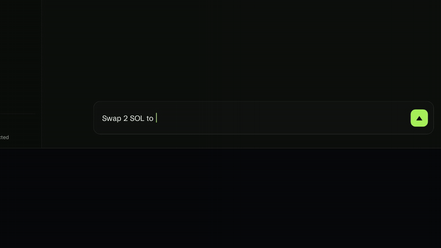
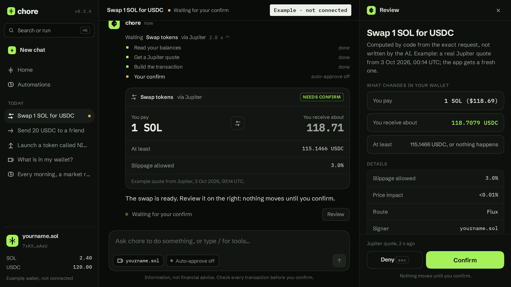
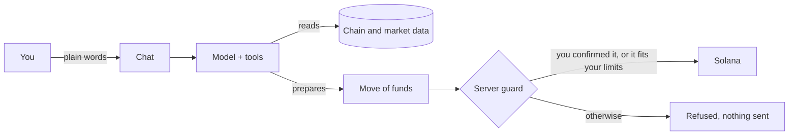

<p align="center"></p>

<h1 align="center"><br>chore</h1>

<p align="center"><b>Say it once. Consider it done.</b><br>Open-source chat agent for Solana. Your Solana chores, handled: say what you want done, it prepares it, you confirm.</p>

<p align="center"><a href="https://choresol.fun">choresol.fun</a> · <a href="https://x.com/CHOREDOTAI">X</a> · <a href="https://t.me/ChoreHome">Telegram</a> · <a href="https://github.com/DevARTURIA/chore">GitHub</a></p>

<p align="center">


</p>

<p align="center"><a href="#what-it-does">What it does</a> · <a href="#demo">Demo</a> · <a href="#who-holds-the-key">Who holds the key</a> · <a href="#safety-and-limits">Safety</a> · <a href="#run-it-yourself">Run it</a> · <a href="#the-chore-token">Token</a></p>

<br>

<p align="center"></p>

## What it does

- **Plain words in, on-chain actions out.** Check a wallet, swap with Jupiter, send tokens, launch a token on Pump.fun, look up a collection on Magic Eden, from one chat.
- **Checks before you buy.** A token check reads mint and freeze authority, holder concentration, creator share, liquidity, age and organic activity before any swap into a token that is not SOL, USDC or USDT. It gives signals, never a guarantee.
- **Explains a transaction.** Paste a signature: what left and entered the wallet, the fee, the programs used, in plain words.
- **Orders that wait for the price.** Limit orders and DCA, take-profit and stop-loss (one cancels the other) and trailing stops, through Jupiter's Trigger API. Funds wait in your Jupiter vault until the order fills, expires (30 days by default) or is cancelled.
- **Watches what you hold.** Price alerts, a daily wallet digest, and a rug watch on every token you hold that reports only what changed: the creator sold, liquidity left, holders concentrated, the price fell by half. Scheduled actions send them on Telegram.
- **Share cards.** An image of your wallet's PnL, one token's PnL, your holdings or the rug watch, computed by the server from the chain, with a public proof page.

## Watch its eye

The mark is an eye, and it tells you what the agent is doing.

<table align="center">
<tr>
<td align="center" width="140"><br><sub><b>idle</b><br>nothing running</sub></td>
<td align="center" width="140"><br><sub><b>reading</b><br>the chain, a quote</sub></td>
<td align="center" width="140"><br><sub><b>waiting</b><br>for your confirm</sub></td>
<td align="center" width="140"><br><sub><b>denied</b><br>nothing left</sub></td>
</tr>
</table>

## Demo

<p align="center"></p>

The animation and this image come from a replica of the interface that plays example requests and touches no wallet. They show how the app looks and behaves, not a live session. There is no hosted demo yet.

## Who holds the key

Read this before you put funds in a **chore** wallet.

- **The server holds it.** By default the server creates a Solana wallet for each account. Its private key is stored in the database, encrypted with `WALLET_ENCRYPTION_KEY`, and the server signs with it.
- **You cannot export it.** A wallet created by the server has no button to reveal or download its private key. Funds in it leave only through the app: a swap, an order, or Send to another address. A wallet you import through Privy is different: Privy signs for it, and its wallet card has an Export button.
- **Whoever runs the deployment can move funds in server wallets.** That is true of any server-side wallet. Use a deployment you trust, or run your own, and keep in it only what you are ready to lose.
- An export for server wallets is on the list, with no date yet. Until it exists, treat a **chore** wallet as a hot wallet for small amounts, not as storage.

## Safety and limits

- **chore** never asks for your seed phrase or private key. Nobody from the project will either.
- **A server check in front of every move of funds.** Swap, send, token launch, limit order, exit order and DCA all go through it: you confirmed this exact move, or it fits your auto-approve limits. The model cannot talk its way past it, and neither can a page or a message it reads.
- **Auto-approve limits.** In Account you set a limit per move and per 24 h, in dollars. Both are 0 by default, so everything waits for your click. They apply to swaps and orders only: sending to another wallet and launching a token always ask. Scheduled automations only ever use the limits.
- **The review sheet is written by code, not by the model.** It comes from the exact request: the Jupiter quote, your balance, the receiver read on chain. A quote older than 30 s has to be refreshed. A move whose result never came back is marked "result unknown" and never retried on its own.
- The agent is a language model calling third-party APIs: it can misread a request or show stale data. Information, not financial advice.
- Not affiliated with Solana, Jupiter, Pump.fun, Magic Eden or any other service it integrates. Found a vulnerability? See [SECURITY.md](SECURITY.md).



## Run it yourself

**chore** is a Next.js app with Postgres. Free to use, MIT licensed, no hosted version yet.

```bash
git clone https://github.com/DevARTURIA/chore && cd chore
pnpm install && cp .env.example .env   # fill in the keys: LOCAL_DEV.md
pnpm run generate && pnpm run migrate && pnpm run dev
```

| Key                                            | What for                                                                                      |
| ---------------------------------------------- | --------------------------------------------------------------------------------------------- |
| `NEXT_PUBLIC_PRIVY_APP_ID`, `PRIVY_APP_SECRET` | Sign-in                                                                                       |
| `WALLET_ENCRYPTION_KEY`                        | Encrypts every server wallet. Back it up, never commit it: lose it and those wallets are lost |
| `OPENAI_API_KEY` or `ANTHROPIC_API_KEY`        | The model                                                                                     |
| `HELIUS_API_KEY`, `NEXT_PUBLIC_HELIUS_RPC_URL` | Chain data, full PnL on share cards                                                           |
| `JUPITER_API_KEY`                              | Limit orders, DCA, take-profit and stop-loss                                                  |
| `DATABASE_URL`, `DIRECT_URL`                   | Postgres                                                                                      |
| `CRON_SECRET`                                  | Protects the scheduled jobs                                                                   |
| `TELEGRAM_BOT_TOKEN`                           | Alerts and scheduled reports (optional)                                                       |

The full list, with the optional ones, is in [LOCAL_DEV.md](LOCAL_DEV.md).

## The $chore token

**chore** is free to use and does not need a token. `$chore` is a community token: it gives no access, no right and no revenue, and nothing here says what its price will do.

<!--ca-->`$chore` contract address: posted here and on X at launch, never before. Any address posted before that is not ours.<!--/ca-->

## Credits

- [Solana Agent Kit](https://github.com/sendaifun/solana-agent-kit) by SendAI (Apache-2.0).
- Built on third-party services and open-source software including Solana, Jupiter, Magic Eden, Pump.fun, DexScreener, Defined.fi, Birdeye, Privy, Helius, OpenAI, Anthropic, Prisma and Next.js. These projects are not affiliated with **chore**.
- Fonts: [Schibsted Grotesk](https://fonts.google.com/specimen/Schibsted+Grotesk) and [IBM Plex Mono](https://fonts.google.com/specimen/IBM+Plex+Mono), SIL Open Font License 1.1 (text in [`src/assets/cards/OFL.txt`](src/assets/cards/OFL.txt)).
- Loading indicators redrawn from ideas in Amicro (MIT); no code copied.

## Visuals

The header photo and the photos behind the share cards were generated with AI (Higgsfield) and color-graded. The eye, its states, the cards and the interface are drawn by code.

## License

MIT. See [LICENSE.md](LICENSE.md).

## Links

- Website: [choresol.fun](https://choresol.fun)
- X: [@CHOREDOTAI](https://x.com/CHOREDOTAI)
- Telegram: [t.me/ChoreHome](https://t.me/ChoreHome)
- GitHub: [DevARTURIA/chore](https://github.com/DevARTURIA/chore)
- Token: `$chore`, contract address posted at launch only
